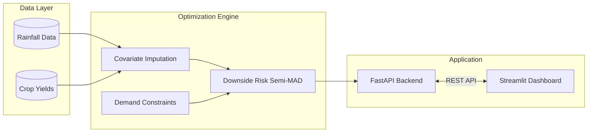

# IsoYield Engine 

### Climate Risk & Portfolio Optimization for Subsistence Agriculture

[](https://www.python.org/)
[](https://fastapi.tiangolo.com/)
[](https://streamlit.io/)
[](http://www.pyomo.org/)
[](https://www.gnu.org/software/glpk/)
[](LICENSE)

**[Live Demo →](https://isoyield-engine-nucxr8xlmsjwf5zpb83ua4.streamlit.app/)**

An enterprise-grade **Operations Research** and **Data Science** engine designed to mitigate systemic climate risk in subsistence agriculture, bridging empirical data science with convex optimization.

---

## Table of Contents

- [Overview](#overview)
- [Key Features](#key-features)
- [System Architecture](#system-architecture)
- [The Mathematical Engine](#the-mathematical-engine)
- [Dashboard Visualizations](#dashboard-visualizations)
- [Getting Started](#getting-started)
- [Model Boundaries](#model-boundaries)
- [Citations & Sources](#mathematical-citations--sources)
- [Contributing](#contributing)
- [License](#license)

---

## Overview

Traditional agricultural models optimize for maximum expected yield, which quietly pushes farmers toward high-profit, water-sensitive crops. When a monsoon fails, these portfolios don't just underperform, they collapse.

**IsoYield Engine** takes a different approach. Using **Linear Programming (GLPK)** and **Downside Risk (Semi-MAD)**, it computes a mathematically optimal crop portfolio that maximizes revenue while strictly bounding worst-case financial losses. It doesn't just tell farmers what makes the most money but also tells them what lets them survive the worst years.

> Built on 10 years of historical rainfall and yield data from Uttar Pradesh, modeling 9 major crops.

---

## Key Features

| Feature | What it does |
|---|---|
| **Robust Downside Protection** | Uses Semi-MAD to penalize only the "ruin" region of outcomes — not all volatility — so upside potential isn't needlessly sacrificed. |
| **Ultra-Low Latency API** | The LP matrix is instantiated in-memory at server startup. Solves 10-year systemic LP problems and returns JSON in **< 50ms**. |
| **True Covariance Simulation** | Anchors all crop yield variance to a single exogenous variable — actual monsoon rainfall — instead of independent Monte Carlo noise, preserving real systemic shocks. |
| **Global Optimum Convergence** | Reduces non-linear market elasticity into a piecewise linear problem, guaranteeing a global optimum via GLPK without slow branch-and-bound MIP solvers. |
| **Theme-Aware Design System** | A dark/light-canvas Streamlit dashboard with custom typography, interactive math playgrounds, and live data visualizations. |

---

## System Architecture

A strictly decoupled frontend/backend architecture enables fast optimization cycles:



### Directory Structure

```
IsoYield-Engine/
├── src/
│   ├── api/         # FastAPI backend — thread-safe mutation of Pyomo params
│   ├── model/        # Pyomo optimization logic, constraints, objective functions
│   ├── dashboard/     # Streamlit app: Status Quo vs. LP Optimized views
│   └── data/         # Historical rainfall & crop yield data handling
├── rain-agriculture.csv
├── requirements.txt
└── Dockerfile
```

- **`src/api/`** — Powered by FastAPI. Requests use a `threading.Lock` to safely mutate `pyo.Param(mutable=True)` in the pre-compiled solver matrix without race conditions.
- **`src/model/`** — Contains the Pyomo optimization logic, constraints, and objective functions.
- **`src/dashboard/`** — A dynamic Streamlit dashboard with an App view (Status Quo vs. LP Optimized) and an interactive Documentation view.
- **`src/data/`** — Modules for handling historical rainfall (`rain-agriculture.csv`) and crop data for empirical covariate imputation.

---

## The Mathematical Engine

This project stands on three core mathematical pillars.

### 1. Empirical Covariate Imputation (Yield Estimation)

To optimize a portfolio, we need to know how crops behave under stress. Simulated yield $Y_{c,y}$ of crop $c$ in historical year $y$ is modeled using a drought-resistance coefficient $\alpha_c$:

$$
Y_{c,y} = \mu_c \cdot \left( \alpha_c + (1 - \alpha_c)\frac{R_y}{\bar{R}} \right) + \epsilon
$$

Instead of random noise, every crop is anchored to the same historical rainfall timeline. This ensures a drought's systemic shock accurately devastates water-intensive crops (like Rice) while hardy crops (like Sorghum) survive.

### 2. Downside Risk Optimization (Semi-MAD)

Farmers don't fear windfall profits — they fear bankruptcy. So the engine uses **Downside Mean Absolute Deviation (Semi-MAD)**. The Pyomo objective maximizes expected revenue minus a dynamically scaled penalty $\lambda$ for expected shortfalls $\delta^-$:

$$
\max \left( E[M] - \text{Water Penalty} - \lambda \cdot \frac{1}{Y} \sum_{y=1}^{Y} \delta^-_y \right)
$$

Turning up the risk-aversion penalty $\lambda$ makes the solver aggressively avoid crop combinations that fall below the expected mean in historical drought years, trading a sliver of "good year" upside for guaranteed survival in bad ones.

### 3. Piecewise Concave Demand Constraints

To stop the LP solver from infinitely mono-cropping the most profitable crop, market elasticity is modeled with piecewise linear tiers:

- **Tier 1** — the first $X$ tons of a crop sell at a high base price.
- **Tier 2** — production beyond $X$ tons gluts the market and sells at a discounted price.

$$
\text{Revenue}_c = \min(\text{Production}_c, X) \cdot P_{high} + \max(0, \text{Production}_c - X) \cdot P_{low}
$$

This forces the model toward an inflection point where diversifying into a secondary crop becomes more profitable than flooding the market with a single crop.

---

## Dashboard Visualizations

The Streamlit dashboard translates the math into actionable insight. Try it live in the [demo](https://isoyield-engine-nucxr8xlmsjwf5zpb83ua4.streamlit.app/):

- **Acreage Comparison** *(Grouped Bar Chart)* — Status Quo vs. diversified LP-Optimized portfolio.
- **Optimized Composition** *(Treemap)* — hierarchical view of the exact 100% land allocation.
- **Empirical Downside Risk Back-Test** *(Temporal Bar Chart)* — visualizes shortfall variables $\delta^-_y$, showing how the optimized portfolio would have survived known drought years.
- **Margin Distribution** *(Box Plot)* — shows how optimization lifts the "worst-case" whisker of the profit spread safely above the bankruptcy line.
- **Interactive Documentation** — live math playgrounds with real-time sliders built into the UI.

---

## Getting Started

Want to run it locally instead of using the [live demo](https://isoyield-engine-nucxr8xlmsjwf5zpb83ua4.streamlit.app/)? Follow the steps below.

### Prerequisites

- **Python 3.10+**
- **GLPK solver**
  - Windows: `winget install glpk`
  - Linux (Ubuntu): `sudo apt-get install glpk-utils`
  - macOS (Homebrew): `brew install glpk`

### Installation

```bash
# 1. Clone the repository
git clone https://github.com/DakshaBhardwaj/IsoYield-Engine.git
cd IsoYield-Engine

# 2. Create a virtual environment
python -m venv venv
source venv/bin/activate  # On Windows: venv\Scripts\activate

# 3. Install dependencies
pip install -r requirements.txt
```

### Usage

Run the FastAPI backend and Streamlit frontend concurrently, in two terminals:

```bash
# Terminal 1 — Backend API
uvicorn src.api.main:app --reload --port 8000
```

```bash
# Terminal 2 — Frontend Dashboard
streamlit run src/dashboard/app.py
```

Then open **http://localhost:8501** in your browser. Toggle Dark/Light mode in Streamlit's settings to see the theme-aware design system in action.

---

## Model Boundaries

Every model is a simplification of reality. Current limitations:

1. **The Linearity Fallacy** — assumes yield scales linearly with rainfall, ignoring crop destruction from excessive flooding (would require a Gaussian bell-curve yield response).
2. **Static Price Elasticity** — uses static base prices across scenarios; does not natively model inverse price elasticity (prices spiking when drought crashes supply).
3. **Spatial Homogeneity** — aggregates land into a single mega-farm, abstracting away localized logistics, transport costs, and micro-soil variation (would require a multi-zone spatial LP).

---

## Mathematical Citations & Sources

- **Downside Risk (Semi-MAD)**
  - Konno, H., & Yamazaki, H. (1991). *Mean-Absolute Deviation Portfolio Optimization Model and Its Applications to Tokyo Stock Market.* Management Science, 37(5), 519–531.
  - Speranza, M. G. (1993). *Linear Programming Models for Portfolio Optimization.* Finance and Stochastics, 14, 107–123.

- **Piecewise Linear Convex Optimization**
  - Dantzig, G. B. (1963). *Linear Programming and Extensions.* Princeton University Press.

- **Agricultural Covariance Models**
  - Hazell, P. B. R. (1984). *Sources of Increased Instability in Indian and U.S. Cereal Production.* American Journal of Agricultural Economics, 66(3), 302–311.

---

## Contributing

Contributions are welcome. If you'd like to improve the model, add new constraints, or enhance the dashboard, feel free to fork the repository and submit a Pull Request.

## License

This project is licensed under the [MIT License](LICENSE).

---

<p align="center"><i>Built as an exploration of Operations Research, Linear Programming, and robust architectural design.</i></p>
