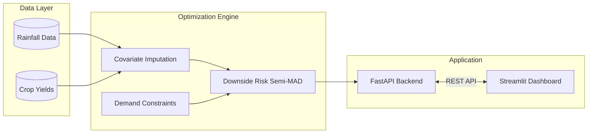

# IsoYield Engine: Climate Risk & Portfolio Optimization


An enterprise-grade **Operations Research** and **Data Science** engine designed to mitigate systemic climate risk in subsistence agriculture. It bridges empirical data science with convex optimization.

---

## Overview

Traditional agricultural models focus on maximizing expected yield, which often pushes farmers to plant highly profitable but water-sensitive crops. When a monsoon fails (drought), these portfolios suffer catastrophic financial ruin.

This engine solves that problem by using **Linear Programming (GLPK)** and **Downside Risk (Semi-MAD)** to generate a mathematically optimal crop portfolio that maximizes revenue while strictly bounding worst-case financial losses. It tells farmers not just what makes the most money, but what allows them to survive the worst years.

---

## Key Features

- **Robust Downside Protection**: Directly targets and minimizes catastrophic downside risk using Semi-MAD, penalizing only the "ruin" region rather than all volatility.
- **Ultra-Low Latency API**: The LP Matrix is instantiated globally in-memory at server startup, avoiding recompilation. Solves 10-year systemic LP matrices and returns JSON in `< 50ms`.
- **True Covariance Simulation**: Anchors all yield variance to a single exogenous empirical variable (monsoon rainfall) rather than relying on independent Monte Carlo simulations, preserving true systemic shocks.
- **Global Optimum Convergence**: Reduces non-linear market elasticity into a piecewise linear problem, guaranteeing global optimum convergence via GLPK without slow branch-and-bound MIP solvers.
- **GSAP-Inspired Design System**: The Streamlit dashboard uses a bespoke dark-canvas/light-canvas theme-aware UI inspired by GSAP, featuring custom typography, interactive math playgrounds, and intuitive data visualizations.

---

## System Architecture

This project features a strictly decoupled frontend/backend architecture, enabling rapid optimization cycles:



### Directory Structure
- **`src/api/`**: Powered by FastAPI. API requests utilize a `threading.Lock` to safely mutate specific parameters (`pyo.Param(mutable=True)`) in the pre-compiled solver matrix without race conditions.
- **`src/model/`**: Contains the Pyomo optimization logic, constraints, and objective functions.
- **`src/dashboard/`**: A dynamic Streamlit dashboard featuring an App view (Status Quo vs. LP Optimized) and a highly interactive Documentation view built with a modern design system.
- **`src/data/`**: Modules for handling historical rainfall (`rain-agriculture.csv`) and crop data for empirical covariate imputation.

---

## The Mathematical Engine

This project stands on three core mathematical pillars.

### 1. Empirical Covariate Imputation (Yield Estimation)
To optimize a portfolio, we need to know how crops behave under stress. We model the simulated yield ($Y_{c,y}$) of a crop ($c$) in a historical year ($y$) using a drought-resistance coefficient ($\alpha_c$):

$$ Y_{c,y} = \mu_c \cdot \left( \alpha_c + (1 - \alpha_c)\frac{R_y}{\bar{R}} \right) + \epsilon $$

Instead of random noise, the model anchors every crop to the same historical timeline ($R_y / \bar{R}$). This guarantees that the systemic shock of a drought accurately devastates water-intensive crops (like Rice) while hardy crops (like Sorghum) survive.

### 2. Downside Risk Optimization (Semi-MAD)
Farmers do not fear windfall profits; they fear bankruptcy. Therefore, we use **Downside Mean Absolute Deviation (Semi-MAD)**. The Pyomo Objective Function maximizes Expected Revenue minus a dynamically scaled penalty ($\lambda$) for expected shortfalls ($\delta^-$):

$$ \max \left( E[M] - \text{Water Penalty} - \lambda \cdot \frac{1}{Y} \sum_{y=1}^{Y} \delta^-_y \right) $$

By turning up the Risk Aversion Penalty ($\lambda$), the solver aggressively avoids crop combinations that fall below the expected mean during historical drought years, trading a tiny bit of "good year" upside for guaranteed survival.

### 3. Piecewise Concave Demand Constraints
To prevent the LP solver from infinitely mono-cropping the most profitable crop, we model market elasticity using piecewise linear tiers:
- **Tier 1:** The first $X$ tons of a crop can be sold at a High Base Price.
- **Tier 2:** Any production beyond $X$ tons gluts the market and must be sold at a Low Discount Price.

$$ \text{Revenue}_c = \min(\text{Production}_c, X) \cdot P_{high} + \max(0, \text{Production}_c - X) \cdot P_{low} $$

This forces the model to hit an inflection point where diversifying into a secondary crop becomes mathematically more profitable than flooding the market with the primary crop.

---

## Dashboard Visualizations

The Streamlit dashboard translates these mathematics into actionable insights:
- **Acreage Comparison (Grouped Bar Chart)**: Compares the highly concentrated "Status Quo" against the diversified "LP Optimized" portfolio.
- **Optimized Composition (Treemap)**: A hierarchical block chart showing the exact 100% land distribution strategy.
- **Empirical Downside Risk Back-Test (Temporal Bar Chart)**: Visualizes the $\delta^-_y$ shortfall variables, proving how the optimized portfolio would have survived known historical drought years.
- **Margin Distribution (Box Plot)**: Plots statistical variance to demonstrate how the optimization lifts the "Worst-Case" whisker of the profit spread safely above the bankruptcy line.
- **Interactive Documentation**: Mathematical playgrounds with real-time sliders built directly into the UI.

---

## Getting Started

### Prerequisites

Ensure you have **Python 3.10+** and the **GLPK** solver installed on your system.

* **Windows:** `winget install glpk`
* **Linux (Ubuntu):** `sudo apt-get install glpk-utils`
* **macOS (Homebrew):** `brew install glpk`

### Installation

1. **Clone the repository**
   ```bash
   git clone https://github.com/yourusername/agri-optimizer.git
   cd agri-optimizer
   ```

2. **Create a virtual environment**
   ```bash
   python -m venv venv
   source venv/bin/activate  # On Windows use: venv\Scripts\activate
   ```

3. **Install dependencies**
   ```bash
   pip install -r requirements.txt
   ```

### Usage

The application requires running both the FastAPI backend and the Streamlit frontend concurrently.

1. **Start the Backend API:**
   ```bash
   uvicorn src.api.main:app --reload --port 8000
   ```

2. **Start the Frontend Dashboard (in a new terminal):**
   ```bash
   streamlit run src/dashboard/app.py
   ```

3. **Access the Application:**
   Open your browser and navigate to `http://localhost:8501` to interact with the dashboard. Toggle between Dark and Light mode in Streamlit settings to see the dynamic design system in action.

---

## Model Boundaries

Every model is a simplification of reality. Current limitations include:
1. **The Linearity Fallacy**: Assumes yield as a strictly linear function of rainfall, ignoring crop destruction caused by excessive flooding (requires a Gaussian bell-curve yield response).
2. **Static Price Elasticity**: Uses static base prices across scenarios. It does not natively account for inverse price elasticity (market prices spiking when crop supply crashes due to drought).
3. **Spatial Homogeneity**: Aggregates land constraints into a singular mega-farm, abstracting localized logistics, transportation costs, and micro-soil environments (requires a multi-zone spatial LP).

---

## Mathematical Citations & Sources

The operations research and mathematical models driving this engine are derived from the following foundational literature:

- **Downside Risk (Semi-MAD)**
  - *Konno, H., & Yamazaki, H. (1991).* "Mean-Absolute Deviation Portfolio Optimization Model and Its Applications to Tokyo Stock Market." *Management Science*, 37(5), 519-531. (Foundational substitution of variance with absolute deviation for linear programming).
  - *Speranza, M. G. (1993).* "Linear Programming Models for Portfolio Optimization." *Finance and Stochastics*, 14, 107-123. (Specifically introduced downside risk Semivariance approximations via LP).

- **Piecewise Linear Convex Optimization**
  - *Dantzig, G. B. (1963).* "Linear Programming and Extensions." *Princeton University Press*. (Core mechanics of reducing non-linear constraints into piecewise linear segments for simplex solvers).

- **Agricultural Covariance Models**
  - *Hazell, P. B. R. (1984).* "Sources of Increased Instability in Indian and U.S. Cereal Production." *American Journal of Agricultural Economics*, 66(3), 302-311. (Modeling systemic yield shocks based on shared regional weather patterns).

---

## Contributing
Contributions are welcome! If you'd like to improve the model, add new constraints, or enhance the dashboard, please feel free to fork the repository and submit a Pull Request.

## License
This project is licensed under the MIT License - see the [LICENSE](LICENSE) file for details.

---
*Built as an exploration of Operations Research, Linear Programming, and robust architectural design.*
