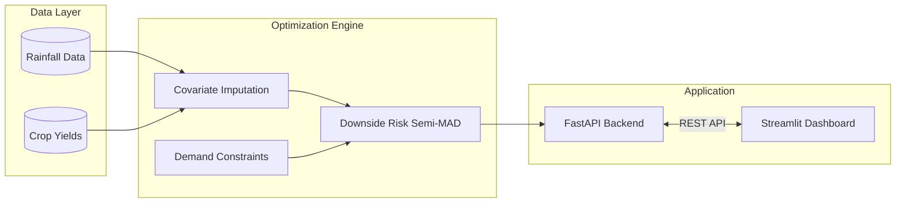

# Agri-Economics Optimizer: Climate Risk & Portfolio Optimization


An enterprise-grade **Operations Research** and **Data Science** engine designed to mitigate systemic climate risk in subsistence agriculture.

## Overview

Traditional agricultural models focus on maximizing expected yield, which often pushes farmers to plant highly profitable but water-sensitive crops. When a monsoon fails (drought), these portfolios suffer catastrophic financial ruin. 

This engine solves that problem by using **Linear Programming (GLPK)** and **Downside Risk (Semi-MAD)** to generate a mathematically optimal crop portfolio that maximizes revenue while strictly bounding worst-case financial losses.

## Key Features

- **Robust Downside Protection**: Directly targets and minimizes catastrophic downside risk. Highly applicable for crop insurance pricing and government drought-subsidy planning.
- **Ultra-Low Latency API**: Matrix is instantiated globally in-memory at server startup, avoiding recompilation. Solves 10-year systemic LP matrices and returns JSON in `< 50ms`.
- **True Covariance Simulation**: Anchors all yield variance to a single exogenous empirical variable (monsoon rainfall) rather than relying on independent Monte Carlo simulations.
- **Global Optimum Convergence**: Reduces non-linear market elasticity into a piecewise linear problem, guaranteeing global optimum convergence via GLPK without slow branch-and-bound MIP solvers.

## Architecture

This project features a strictly decoupled frontend/backend architecture:



- **Backend (`src/api/` & `src/model/`)**: Powered by FastAPI and Pyomo. API requests utilize a `threading.Lock` to safely mutate specific parameters (`pyo.Param(mutable=True)`) in the pre-compiled solver matrix.
- **Frontend (`src/dashboard/`)**: A dynamic Streamlit dashboard that visualizes the "Status Quo" actual crop allocations versus the "LP Optimized" recommendations.
- **Data (`src/data/`)**: Modules for handling historical rainfall and crop data for empirical covariate imputation.

## The Mathematical Engine

This project bridges empirical data science with convex optimization through three core mathematical pillars:

### 1. Empirical Covariate Imputation (Yield Estimation)
To measure risk accurately, we preserve the true covariance of crop failures by extracting true historical monsoon rainfall ($R_y$) anomalies to estimate historical yields ($Y_{c,y}$) using a drought-resistance coefficient ($\alpha_c$):

$$ Y_{c,y} = \mu_c \cdot \left( \alpha_c + (1 - \alpha_c)\frac{R_y}{\bar{R}} \right) + \epsilon $$

### 2. Downside Risk Optimization (Semi-MAD)
We implement Downside Mean Absolute Deviation (Semi-MAD) to penalize only downside loss rather than all deviation from the mean. The Pyomo Objective Function maximizes Expected Revenue minus a dynamically scaled penalty ($\lambda$) for expected shortfalls:

$$ \max \left( E[M] - \text{Water Penalty} - \lambda \cdot E[\delta^-] \right) $$

### 3. Piecewise Concave Demand Constraints
To model market elasticity natively within a Linear Programming (LP) framework, we utilize piecewise concave revenue tiers. The model is forced to fulfill Tier 1 (Base Price) before expanding to Tier 2 (Lower Price), preventing infinite mono-cropping.

## Getting Started

### Prerequisites

Ensure you have **Python 3.10+** and the **GLPK** solver installed on your system.

* **Windows:** `winget install glpk`
* **Linux (Ubuntu):** `sudo apt-get install glpk-utils`
* **macOS (Homebrew):** `brew install glpk`

### Installation

1. **Clone the repository**
   ```bash
   git clone https://github.com/yourusername/agri-optimizer.git
   cd agri-optimizer
   ```

2. **Create a virtual environment (Optional but recommended)**
   ```bash
   python -m venv venv
   source venv/bin/activate  # On Windows use: venv\Scripts\activate
   ```

3. **Install dependencies**
   ```bash
   pip install -r requirements.txt
   ```

## Usage

The application requires running both the FastAPI backend and the Streamlit frontend concurrently.

1. **Start the Backend API:**
   ```bash
   uvicorn src.api.main:app --reload --port 8000
   ```

2. **Start the Frontend Dashboard (in a new terminal):**
   ```bash
   streamlit run src/dashboard/app.py
   ```

3. **Access the Application:**
   Open your browser and navigate to `http://localhost:8501` to interact with the optimization dashboard.

## Model Limitations & Considerations

While highly effective, the current model has known boundaries:
- **The Linearity Fallacy**: Assumes yield as a strictly linear function of rainfall, ignoring crop destruction caused by excessive flooding (the right side of the bell curve).
- **Static Price Elasticity**: Uses static base prices across scenarios. It does not natively account for inverse price elasticity (market prices spiking when crop supply crashes due to drought).
- **Spatial Homogeneity**: Aggregates land constraints into a singular mega-farm, abstracting localized logistics, transportation costs, and micro-soil environments.

## Contributing

Contributions are welcome! If you'd like to improve the model, add new constraints, or enhance the dashboard, please feel free to fork the repository and submit a Pull Request.

## License

This project is licensed under the MIT License - see the [LICENSE](LICENSE) file for details.

---
*Built as an exploration of Operations Research, Linear Programming, and robust architectural design.*
